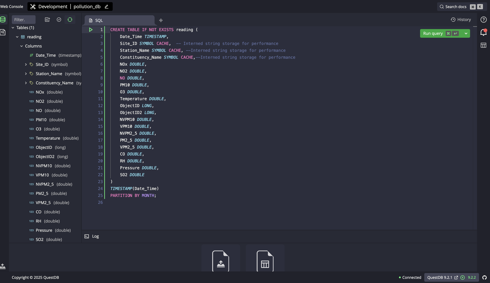
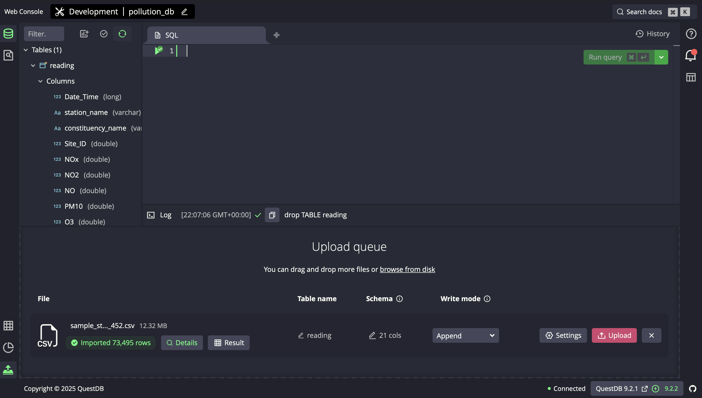
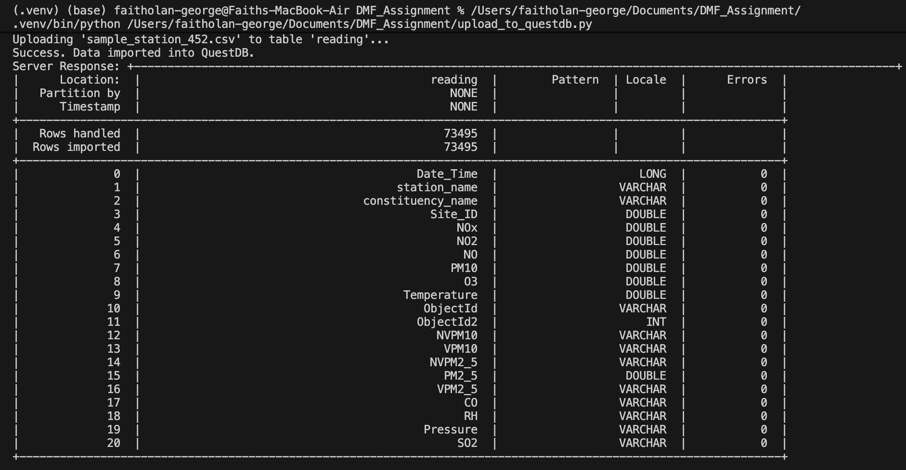
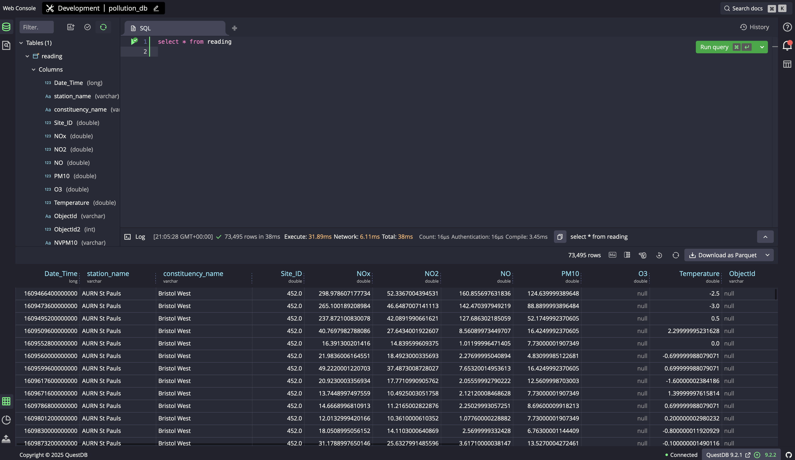
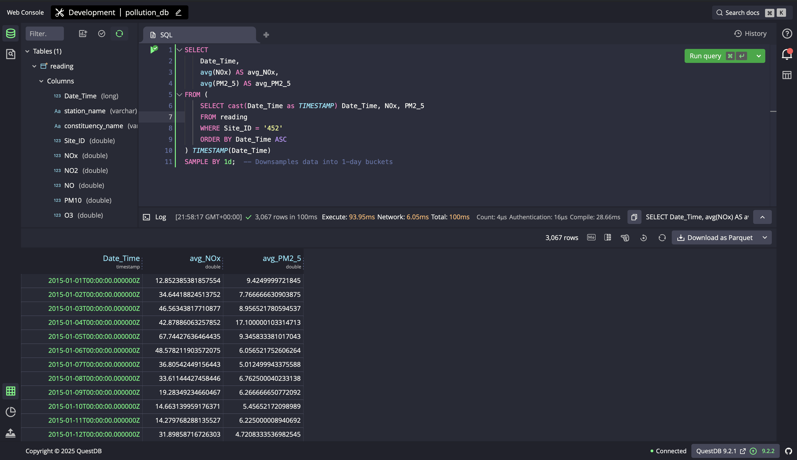

# Component 6: NoSQL Data Model and Implementation
**Module:** UFCFLR-15-M
**Assessment:** Modelling & Mapping Bristol Air Quality Data

1\. Introduction and Technology Selection
-----------------------------------------

In this report, I critically evaluate the architectural suitability of a non-relational (NoSQL) model for a high-velocity environmental sensor data. I identified the Bristol Air Quality dataset as a classic time-series workload: an immutable sequence of data points indexed primarily by time.

While the relational model guarantees Referential Integrity through normalisation, I observed inherent limitations when scaling for the 'Velocity' and 'Volume' attributes of Big Data. Traditional Relational Database Management Systems (RDBMS) rely on B-Tree indexing, incurring a logarithmic performance penalty (O(logN)) as write volume increases (Tiger Data, 2023). Additionally, RDBMS architectures are optimised for Online Transaction Processing (OLTP), whereas sensor data analysis requires Online Analytical Processing (OLAP) capabilities.

To address these limitations, I selected **QuestDB**, a high-performance Time-Series Database (TSDB). Unlike general-purpose document stores such as MongoDB, QuestDB utilises a columnar storage engine specifically engineered to minimise write amplification and maximise ingestion throughput, making it architecturally superior for IoT workloads (QuestDB, 2024).

2\. Data Modelling Strategy
---------------------------

Transitioning from a relational database management system (such as the data ingestion performed in component 4) to a time series database requires a paradigm shift from a 'schema-first', normalised approach to a 'query-first', denormalised strategy.

### 2.1. Denormalisation and Schema Design

In the relational database implementation, I ensured the data was strictly normalised into `Station`, `Constituency`, and `Reading` tables to satisfy Third Normal Form (3NF) normalisation. However, for QuestDB model, I adopted a 'wide-table' denormalised approach with the  `Site_ID` retained within the main readings table. To mitigate storage inefficiency usually associated with denormalisation, I implemented QuestDB specialised `SYMBOL` data type. This interning maps repeating strings to internal integers, reducing storage and eliminating the need for computationally expensive `JOIN` operations (Li and Manoharan, 2013).

### 2.2. Storage Architecture: Columnar vs. Row-Oriented

A critical design decision was the adoption of columnar storage.

-   **Row-Oriented (MySQL):** Data is stored sequentially by row. To calculate an average value for a specific pollutant, the database must read the entire row (including irrelevant columns) from the disk, resulting in high I/O overhead (Estuary, 2024).

-   **Columnar (QuestDB):** Data is stored sequentially by column. Aggregation queries (e.g., `AVG(NOx)`) read only the specific column files required. This approach leverages modern CPU architecture by maximising cache locality and enabling vectorised processing (Couchbase, 2024).

### 2.3. Schema Definition

The schema definition utilises QuestDB's SQL extensions to enforce time-partitioning:

```sql
CREATE TABLE IF NOT EXISTS readings (
    Date_Time TIMESTAMP,
    Site_ID SYMBOL CACHE,  -- Interned string storage for performance
    Station_Name SYMBOL CACHE, --Interned string storage for performance
    Constituency_Name SYMBOL CACHE,--Interned string storage for performance
    NOx DOUBLE,
    NO2 DOUBLE,
    NO DOUBLE,
    PM10 DOUBLE,
    O3 DOUBLE,
    Temperature DOUBLE,
    ObjectID LONG,
    ObjectID2 LONG,
    NVPM10 DOUBLE,
    VPM10 DOUBLE,
    NVPM2_5 DOUBLE,
    PM2_5 DOUBLE,
    VPM2_5 DOUBLE,
    CO DOUBLE,
    RH DOUBLE,
    Pressure DOUBLE,
    SO2 DOUBLE
)
TIMESTAMP(Date_Time)
PARTITION BY MONTH;

```


-   **TIMESTAMP(Date_Time):** This designation orders data physically on the disk by time. This enables 'partition pruning', where the query engine skips entire data files that fall outside the requested time range, drastically reducing query latency (QuestDB, 2024).

-   **PARTITION BY MONTH:** This strategy splits the table into physical files based on calendar months, facilitating efficient data lifecycle management (e.g., archiving old data) without the fragmentation caused by `DELETE` operations in RDBMS.


3\. Prototype Implementation
----------------------------

### 3.1. Environment Setup

I implemented the prototype using a local instance of QuestDB 9.2.1 The database can be administered and queried using its web console via `http://localhost:9000`.

### 3.2. Data Preparation (ETL)

 I wrote a Python script (`generate_station_sample.py`) that performed two critical transformation tasks:

```python
import csv
import zipfile
import io
from datetime import datetime

ZIP_FILE = 'cropped.zip' 
CSV_NAME_IN_ZIP = 'cleansed.csv'
OUTPUT_SAMPLE_FILE = 'sample_station_452.csv'
TARGET_SITE_ID = '452'  # AURN St Pauls

STATION_FILE = 'station.csv'
CONSTITUENCY_FILE = 'constituency.csv'
print(f"Extracting and converting sample data for Station {TARGET_SITE_ID}...")


# constituency_id → constituency_name
constituency_lookup = {}
with open(CONSTITUENCY_FILE, 'r', encoding='utf-8-sig') as f:
    reader = csv.DictReader(f)
    for row in reader:
        constituency_lookup[row['constituency_id']] = row['constituency_name']

# site_id → (station_name, constituency_name)
station_lookup = {}
with open(STATION_FILE, 'r', encoding='utf-8-sig') as f:
    reader = csv.DictReader(f)
    for row in reader:
        sid = row['station_id']
        station_name = row['station_name']
        constituency_name = constituency_lookup.get(row['constituency_id'], "")
        station_lookup[sid] = (station_name, constituency_name)

try:
    with open(OUTPUT_SAMPLE_FILE, 'w', newline='', encoding='utf-8') as outfile:
        csv_writer = csv.writer(outfile)
        
        with zipfile.ZipFile(ZIP_FILE, 'r') as zf:
            with zf.open(CSV_NAME_IN_ZIP, 'r') as infile:
                infile_text = io.TextIOWrapper(infile, encoding='utf-8-sig')
                csv_reader = csv.reader(infile_text)
                header = next(csv_reader)
                
                # 1. Find Column Indices
                try:
                    site_id_idx = header.index('Site_ID')
                    date_idx = header.index('Date_Time')

                    # 2. Read Header
                    header[site_id_idx:site_id_idx] = ["station_name", "constituency_name"]
                    csv_writer.writerow(header)
                except ValueError:
                    print("Error: Required columns not found.")
                    exit()
                
                # 3. Stream, Filter, and Convert
                count = 0
                for row in csv_reader:
                    # Filter for 'AURN St Pauls' station
                    if row[site_id_idx].strip().split('.')[0] == TARGET_SITE_ID:

                        #lookup station and constituency names
                        station_name, constituency_name = station_lookup.get(
                            TARGET_SITE_ID, ("", "")
                        )

                        try:
                            # Parse original format: 2015/01/01 00:00:00
                            dt = datetime.strptime(row[date_idx], '%Y-%m-%d %H:%M:%S')
                            
                            # In class, we were given guidance to save date time as unix timestamp.
                            # QuestDB supports unix timestamps but store it as 64-bit integers 
                            # representing micro seconds unlike mysql that stores it as seconds.
                            # For this reason, I am doing the conversion to micro seconds. 
                            # timestamp() gives seconds (float), * 1,000,000 -> microseconds
                            
                            micros = int(dt.timestamp() * 1_000_000)
                            
                            row[date_idx] = micros

                            # 10 Dec 2025 — Lecture Guidance:
                            # We were advised that in NoSQL design, constituency and station details
                            # should be included within the readings document/table (denormalised model).
                            # This update reflects that guidance by embedding Station_Name and Constituency_Name.

                            row[site_id_idx:site_id_idx] = [station_name, constituency_name]
                            csv_writer.writerow(row)
                            count += 1
                        except ValueError:
                            continue # Skip bad dates
                        
    print(f"Success. Wrote {count} rows to {OUTPUT_SAMPLE_FILE}")
    print("Dates converted to QuestDB-compatible Unix Microseconds.")

except FileNotFoundError:
    print(f"Error: Could not find {ZIP_FILE}. Run this next to your cropped data.")
except Exception as e:
    print(f"An error occurred: {e}")
```

1.  **Filtering:** It extracted only records associated with 'AURN St Pauls' (Site ID 452) for a focused sample dataset.

2.  **Timestamp Conversion:** QuestDB stores timestamps as 64-bit integers representing microseconds since the Unix reference time. The script parsed the ISO-formatted date strings from the source CSV and converted them into Unix microsecond integers, ensuring precise temporal alignment and avoided parsing overhead during ingestion.

### 3.3. Data Ingestion

Initially, I handled data ingestion manually via the `Import Files from CSV` feature of the QuestDB web console and was able to view the ingested data. Subsequently, I automated data ingestion by writing a dedicated python script (`upload_to_questdb.py`) shown below, utilising QuestDB's REST API /imp endpoint. This approach allowed me to stream the transformed CSV data directly into the pre-defined `reading` table, bypassing the need for manual schema inference and ensuring strict adherence to the defined data types.

```python
import requests
import os

FILE_PATH = 'sample_station_452.csv'
QUESTDB_URL = 'http://localhost:9000/imp'
TARGET_TABLE = 'readings'

def upload_data():
    if not os.path.exists(FILE_PATH):
        print(f"Error: '{FILE_PATH}' not found. Run generate_station_sample.py first.")
        return

    print(f"Uploading '{FILE_PATH}' to table '{TARGET_TABLE}'...")

    # I am using the QuestDB Import API and subsequently using the 
    # params={'name': 'readings'} to force it into the readings table 
    # previously created (create script provided in section 2.3 schema definition)
    try:
        with open(FILE_PATH, 'rb') as f:
            response = requests.post(
                QUESTDB_URL,
                params={'name': TARGET_TABLE},
                files={'data': f}
            )
        
        if response.status_code == 200:
            print("Success. Data imported into QuestDB.")
            print(f"Server Response: {response.text}")
        else:
            print("Error uploading data.")
            print(f"Status Code: {response.status_code}")
            print(f"Response: {response.text}")

    except requests.exceptions.ConnectionError:
        print("Could not connect to QuestDB.")
        print("Is the server running at http://localhost:9000?")

if __name__ == "__main__":
    upload_data()
```

### 3.4. Analytical Query

To demonstrate the OLAP capabilities of the model, a query was constructed to downsample the high-resolution data into daily averages. In a relational context, this would require complex `GROUP BY` syntax. QuestDB simplifies this via the `SAMPLE BY` clause:

```sql
SELECT
    Date_Time,
    avg(NOx) AS avg_NOx,
    avg(PM2_5) AS avg_PM2_5
FROM (
    SELECT cast(Date_Time as TIMESTAMP) Date_Time, NOx, PM2_5
    FROM readings
    WHERE Site_ID = '452'
    ORDER BY Date_Time ASC
) TIMESTAMP(Date_Time)
SAMPLE BY 1d;  -- Downsamples data into 1-day buckets

```

*(Note: Screen capture of the query output in section 3.5 confirms successful execution, showing timestamped daily averages for the selected pollutants).*

### 3.5. Screen Captures
-   **Readings table `CREATE` script:** The screen capture below is showing the script used in creating the `readings` table (also provided in section 2.3 Schema Definition)



-   **Manual Data Ingestion:** The screen capture below is from the initial manual data ingestion using the `Import Files from CSV` feature of QuestDB.



-   **Automated Data Ingestion (`upload_to_questdb.py`):** This screen capture is the output from the `upload_to_questdb.py` script showing successful data ingestion.



-   **Database after automated data ingestion:**
This shows the state of the database after the automated ingestion process. Although the table was successfully captured, only a portion of it is visible due to screen size limitations.




-   **Analytical Query Output:** 
This screen capture is the output from the analytical query showing successful query output.




4\. Critical Evaluation: Normalised vs. De-normalised Models
------------------------------------------------------------

This section contrasts the MySQL and QuestDB approaches through the lens of the CAP theorem and architectural suitability.

### 4.1. Consistency vs. Availability (CAP Theorem) and Data Integrity

In Component 1, I prioritised strict data integrity for the MySQL implementation. I applied a 'No Loss' decomposition strategy to create a Third Normal Form (3NF) schema, ensuring all attributes from the source were preserved without redundancy. Furthermore, I explicitly selected the `ObjectId2` field as the Primary Key (`ReadingID`) rather than using a surrogate auto-increment key. This design choice enforced idempotency and data lineage, ensuring that the database state remained traceable to the exact source row (Connolly and Begg, 2015). While this rigour guarantees consistency (C in CAP Theorem), I found it creates a brittle ingestion pipeline where minor data anomalies are rejected.

In contrast, QuestDB prioritises Flexibility and Availability (A). The schema-on-write capabilities and relaxed constraint model allowed the system to accept high-velocity streams without the overhead of checking foreign key constraints against a `Station` table. In an IoT context, I consider the 'availability' to accept write streams is paramount as losing sensor data due to a schema validation error is often unacceptable (MDPI, 2024).

### 4.2. Scalability and Performance

I observed that the relational model scales vertically; handling more data generally requires a larger server. Analytical queries in MySQL degrade as table size increases because B-Tree indexes are generic and not optimised for range scans (Tiger Data, 2023).

However, QuestDB model scales horizontally and utilises Log-Structured Merge (LSM) tree variants or append-only models. By partitioning data by time, locating a specific record range becomes nearly constant (O(1) relative to the total dataset size). Furthermore, the columnar format allows for significant compression ratios, reducing the storage footprint compared to row-oriented storage

5\. Conclusion
--------------

My investigation confirms that while the relational model (MySQL) excels at managing entity relationships and ensuring metadata integrity through 'no loss' normalisation,but it introduces significant friction for massive time-series datasets. NoSQL approach (QuestDB) offers superior ingestion throughput and analytical query performance through its columnar architecture and time-partitioning strategies.

However, I recommend a **Polyglot Persistence** architecture: utilising MySQL for static metadata (Constituency, Station) where integrity is critical, and streaming sensor readings into QuestDB for high-performance storage and analysis.

6\. References
--------------
Connolly, T. and Begg, C. (2015) Database Systems: A Practical Approach to Design, Implementation, and Management. 6th edn. London: Pearson.

Couchbase (2024) Column-Store vs. Row-Store: What's The Difference?. Available from: https://www.couchbase.com/blog/columnar-store-vs-row-store/ [Accessed 13 November 2025].

Estuary (2024) Columnar Database vs Row Database: What to Choose and Why. Available from: https://estuary.dev/blog/columnar-database-vs-row-database/ [Accessed 13 November 2025].

Li, Y. and Manoharan, S. (2013) 'A performance comparison of SQL and NoSQL databases', IEEE Pacific Rim Conference on Communications, Computers and Signal Processing (PACRIM). Victoria, BC, Canada, pp. 15-19.

MDPI (2024) 'SQL and NoSQL Databases: A Comparative Study with Perspectives on AI-Based Migration Approach', Computers, 112(1), p. 72.

QuestDB (2024) Time Series Optimizations. Available from: https://questdb.com/docs/guides/architecture/time-series-optimizations/ [Accessed 11 November 2025].

ResearchGate (2024) A Comparative Analysis of NoSQL and SQL Databases: Performance, Consistency, and Suitability for Modern Applications with a Focus on IoT. Available from: https://www.researchgate.net/publication/390609163 [Accessed 8 November 2025].

Tiger Data (2023) Time-series data: Why to use a relational database instead of NoSQL. Available from: https://www.tigerdata.com/blog/time-series-data-why-and-how-to-use-a-relational-database-instead-of-nosql [Accessed 15 November 2025].