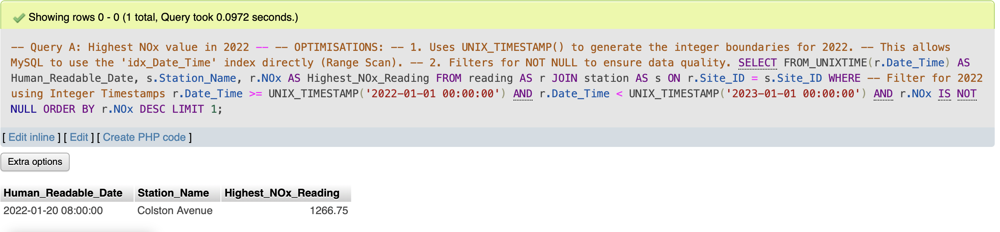
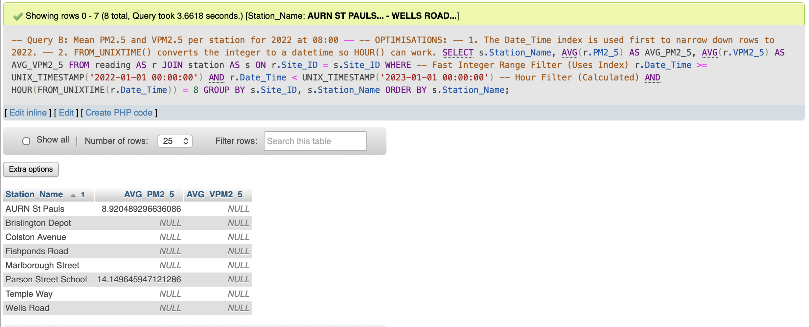
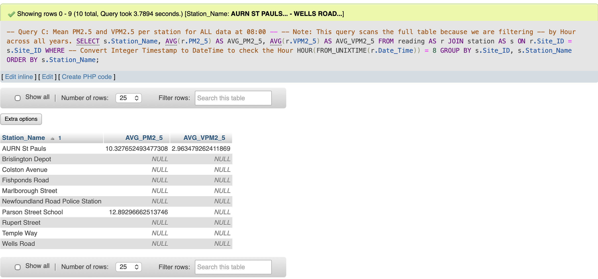

## Component 7: Reflective Report

### Module: UFCFLR-15-M Assessment: Modelling & Mapping Bristol Air Quality Data

## 1. Introduction

This report provides a critical reflection on the end-to-end data management lifecycle undertaken to model, cleanse, and query the Bristol Air Quality dataset. Furthermore, the assignment explored polyglot persistence through the implementation of a NoSQL prototype using QuestDB. This report analyses the specific engineering challenges encountered, particularly spatial mapping, data cleansing, and transaction management, and evaluates the solutions devised to resolve them.

## 2. Critical Review of Implementation Challenges
Significant learning outcomes were derived from practical implementations where theoretical database design principles clashed with the realities of handling large-scale, imperfect data.

## 2.1. Data Modelling and Geospatial Enrichment

In this phase, my primary challenge was adhering to the strict 'no loss' 3NF design while preserving all attributes from the original dataset. The Entity Relationship Diagram (ERD) was designed to preserve all original attributes, from sensor metadata to pollutant readings, within a 'no loss' 3NF normalised structure. By decomposing the dataset into Station, Constituency, and Reading, I eliminated data redundancy and ensured the dataset could be fully reconstructed through SQL joins.
Furthermore, I adopted a programmatic approach to data enrichment. As the source data lacked a foreign key linking station to constituency, I utilised the official 'Westminster Parliamentary Constituencies July 2024 Boundaries' dataset (Office for National Statistics, 2025).The Python script, `map_stations_to_constituencies.py` shown below, perform a spatial join using the station coordinates.
 

```python
"""
Map UK air quality monitoring stations to Westminster Parliamentary Constituencies.

This version:
  1. Reads the full ONS Westminster CSV (nationwide).
  2. Automatically filters to Bristol constituencies (rows containing 'Bristol').
  3. Converts geometries from WKT into shapely polygons.
  4. Transforms station coordinates from WGS84 to British National Grid.
  5. Performs a point-in-polygon spatial join.
  6. Saves a mapping of each station to its constituency.

Requirements:
  pip install pandas shapely pyproj
"""

import csv
import sys
from pathlib import Path

import pandas as pd
from shapely import wkt
from shapely.geometry import Point
from shapely.prepared import prep
from pyproj import Transformer

CSV_PATH = Path("Westminster_Parliamentary_Constituencies_July_2024_Boundaries_UK_BFC.csv")
OUT_PATH = Path("station_to_constituency_bristol.csv")

# 19 monitoring stations: (Site_ID, Name, Latitude, Longitude)
STATIONS = [
    (188, "AURN Bristol Centre", 51.4572041156, -2.58564914143),
    (203, "Brislington Depot", 51.4417471802, -2.55995583224),
    (206, "Rupert Street", 51.4554331987, -2.59626237324),
    (209, "IKEA M32", 51.4752847609, -2.56207998299),
    (213, "Old Market", 51.4560189999, -2.58348949026),
    (215, "Parson Street School", 51.4326757070, -2.60495665673),
    (228, "Temple Meads Station", 51.4488837041, -2.58447776241),
    (270, "Wells Road", 51.4278638883, -2.56374153315),
    (271, "Trailer Portway P&R", 51.4899934596, -2.68877856929),
    (375, "Newfoundland Road Police Station", 51.4606738207, -2.58225341824),
    (395, "Shiner's Garage", 51.4577930324, -2.56271419977),
    (447, "Bath Road", 51.4425372726, -2.57137536073),
    (452, "AURN St Pauls", 51.4628294172, -2.58454081635),
    (459, "Cheltenham Road \\ Station Road", 51.4689385901, -2.5927241667),
    (463, "Fishponds Road", 51.4780449714, -2.53523027459),
    (481, "CREATE Centre Roof", 51.4472134170, -2.62247405516),
    (500, "Temple Way", 51.4579497132, -2.5839890903),
    (501, "Colston Avenue", 51.4552693827, -2.59664882855),
    (672, "Marlborough Street", 51.4591419717, -2.59543271836),
]


def detect_columns(df: pd.DataFrame):
    """Detect constituency name and WKT geometry columns automatically."""
    lower = {c.lower(): c for c in df.columns}

    # name column candidates
    for cand in ("pcon24nm", "pcon22nm", "pconnm", "pconname", "name"):
        if cand in lower:
            name_col = lower[cand]
            break
    else:
        name_col = None
        for c in df.columns:
            s = df[c].astype(str)
            if s.str.contains("Bristol", case=False, na=False).any():
                name_col = c
                break
        if name_col is None:
            raise ValueError("Could not detect constituency name column.")

    # geometry/WKT column
    wkt_col = None
    for c in df.columns:
        s = df[c].astype(str)
        if s.str.startswith("MULTIPOLYGON", na=False).any() or s.str.startswith("POLYGON", na=False).any():
            wkt_col = c
            break
    if wkt_col is None:
        raise ValueError("Could not detect WKT geometry column.")

    return name_col, wkt_col


def load_ons_csv(path: Path) -> pd.DataFrame:
    """Load the national ONS CSV efficiently and clip to Bristol constituencies."""
    with path.open("r", encoding="utf-8", newline="") as f:
        sample = f.read(4096)
        f.seek(0)
        dialect = csv.Sniffer().sniff(sample)
    df = pd.read_csv(path, dtype=str, delimiter=dialect.delimiter, low_memory=False)

    name_col, wkt_col = detect_columns(df)
    bristol_df = df[df[name_col].astype(str).str.contains("Bristol", case=False, na=False)].copy()
    if bristol_df.empty:
        raise ValueError("No Bristol constituencies found in dataset.")
    return bristol_df, name_col, wkt_col


def build_prepared_polygons(df: pd.DataFrame, name_col: str, wkt_col: str):
    """Convert WKT geometries to shapely prepared polygons."""
    geoms = []
    for _, row in df.iterrows():
        cname = str(row[name_col])
        geom_wkt = str(row[wkt_col])
        if not geom_wkt or geom_wkt == "nan":
            continue
        poly = wkt.loads(geom_wkt)
        geoms.append((cname, prep(poly)))
    if not geoms:
        raise ValueError("No valid geometries parsed from Bristol CSV.")
    return geoms


def map_stations(polygons, stations):
    """Map each station to a constituency using British National Grid coordinates."""
    transformer = Transformer.from_crs("EPSG:4326", "EPSG:27700", always_xy=True)
    results = []
    for sid, name, lat, lon in stations:
        x, y = transformer.transform(lon, lat)
        pt = Point(x, y)
        found = None
        for cname, pg in polygons:
            if pg.contains(pt) or pg.intersects(pt):
                found = cname
                break
        results.append({
            "Site_ID": sid,
            "Station": name,
            "Latitude": lat,
            "Longitude": lon,
            "Constituency": found
        })
    return pd.DataFrame(results).sort_values("Site_ID")


def main():
    if not CSV_PATH.exists():
        print(f"ERROR: {CSV_PATH} not found.", file=sys.stderr)
        sys.exit(1)

    bristol_df, name_col, wkt_col = load_ons_csv(CSV_PATH)
    polygons = build_prepared_polygons(bristol_df, name_col, wkt_col)
    mapping_df = map_stations(polygons, STATIONS)
    mapping_df.to_csv(OUT_PATH, index=False)

    print(f"\nDetected columns: name='{name_col}', wkt='{wkt_col}'")
    print(f"Bristol constituencies: {list(bristol_df[name_col].unique())}")
    print(f"\nSaved mapping → {OUT_PATH.resolve()}\n")
    print(mapping_df.to_string(index=False))


if __name__ == "__main__":
    main()

```

 While a surrogate AUTO_INCREMENT key is standard in many relational designs, it lacks a link to the source data. I identified the source column `ObjectId2` served as a unique row identifier and mapped it directly to the `Reading_ID` primary key. This strategic choice enforced Idempotency and Data Lineage: The ETL pipeline (Component 4) could natively detect and reject duplicate records based on their original ID. using a surrogate key would have compromised data integrity by creating new duplicate rows with new IDs after a partial failure(Connolly and Begg, 2015).


## 2.2. Forward engineer the ER model to a MySQL database 

When forward-engineering my schema from MySQL Workbench into phpMyAdmin, I encountered a syntax error:

```
ERROR: Error 1064: You have an error in your SQL syntax; check the manual that corresponds to your MariaDB server version for the right syntax to use near ')
ENGINE = InnoDB' at line 9

```

caused by the VISIBLE keyword for indexes,a feature unsupported by MariaDB.

```sql
UNIQUE INDEX `constituency_name_UNIQUE` (`constituency_name` ASC) VISIBLE
```
I manually removed all VISIBLE attributes from the script. 

```sql
UNIQUE INDEX `constituency_name_UNIQUE` (`constituency_name` ASC) VISIBLE

```
The schema imported successfully, demonstrating the importance of understanding engine specific SQL variations

```sql
UNIQUE INDEX `constituency_name_UNIQUE` (`constituency_name` ASC)
```

## 2.3. ETL Optimisation and Vectorisation

During the data cleansing phase in the script below, I uncovered inefficiencies in standard procedural programming. Initially, the cleansing script used standard Python loops to iterate through the 1.6 million rows for deduplication and sanitisation. I found this scalar processing computationally expensive. Therefore, I refactored the logic using the pandas library, shifting to highly optimised vectorised operations (McKinney, 2017). loading the dataset into a DataFrame, I executed operations such as drop_duplicates() and date filtering in highly optimised code blocks. *`cleansed.py`*

```python
import csv
import zipfile
import io
import math
from datetime import datetime

INPUT_FILE = 'Air_Quality_Continuous.csv'
OUTPUT_ZIP = 'cropped.zip'

# Output Filenames
FILE_CROPPED = 'cropped.csv'           
FILE_CLEANSED = 'cleansed.csv' 

# Date Constraints
START_DATE = datetime(2015, 1, 1)
END_DATE = datetime(2023, 10, 31)

# Column Mapping (Header)
HEADER_COLUMNS = [
    'Date_Time', 'Site_ID', 'NOx', 'NO2', 'NO', 'PM10', 'O3', 'Temperature',
    'ObjectId', 'ObjectId2', 'NVPM10', 'VPM10', 'NVPM2_5', 'PM2_5', 'VPM2_5',
    'CO', 'RH', 'Pressure', 'SO2'
]

METRIC_COLS = {'NOx', 'NO2', 'NO', 'PM10', 'O3', 'NVPM10', 'VPM10', 
               'NVPM2_5', 'PM2_5', 'VPM2_5', 'CO', 'RH', 'Pressure', 'SO2'}

DATE_FORMAT = '%Y/%m/%d %H:%M:%S+00'

def clean_value(col_name, val):
    if not val: return ""
    if col_name in METRIC_COLS:
        try:
            f = float(val)
            if not math.isfinite(f) or f < 0: return ""
            return val
        except ValueError: return ""
    if col_name == 'Temperature':
        try:
            f = float(val)
            if not math.isfinite(f): return ""
            return val
        except ValueError: return ""
    return val

def crop_and_cleanse():
    print(f"Starting processing '{INPUT_FILE}'...")
    
    buffer_cropped = io.StringIO(newline='')
    buffer_cleansed = io.StringIO(newline='')
    
    writer_cropped = csv.writer(buffer_cropped)
    writer_cleansed = csv.writer(buffer_cleansed)
    
    stats = {
        "total_scanned": 0,
        "written_cropped": 0,
        "written_cleansed": 0,
        "duplicates_dropped": 0,
        "bad_keys_dropped": 0
    }
    
    seen_ids = set() 
    
    try:
        with open(INPUT_FILE, 'r', encoding='utf-8-sig') as infile:
            csv_reader = csv.reader(infile)
            header = next(csv_reader)
            
            try:
                col_map = {name: header.index(name) for name in HEADER_COLUMNS}
            except ValueError as e:
                print(f"FATAL: Missing column in header: {e}")
                return

            writer_cropped.writerow(header)
            writer_cleansed.writerow(header)
            
            for row in csv_reader:
                stats["total_scanned"] += 1
                if not row: continue
                
                # Date Filter
                try:
                    date_str = row[col_map['Date_Time']]
                    row_date = datetime.strptime(date_str, DATE_FORMAT)
                except ValueError:
                    continue 
                
                if row_date < START_DATE: continue 
                
                # Write to Raw/Cropped file
                writer_cropped.writerow(row)
                stats["written_cropped"] += 1
                
                if row_date > END_DATE: continue
                
                # Key Validation
                site_id = row[col_map['Site_ID']]
                raw_obj_id2 = row[col_map['ObjectId2']]
                
                if not site_id or not raw_obj_id2:
                    stats["bad_keys_dropped"] += 1
                    continue 
                
                # Strip whitespace to ensure '123' == '123 '
                clean_id = raw_obj_id2.strip()
                
                if clean_id in seen_ids:
                    stats["duplicates_dropped"] += 1
                    continue
                
                seen_ids.add(clean_id)

                # Value Sanitisation
                clean_row = list(row)
                for col_name in METRIC_COLS:
                    idx = col_map[col_name]
                    clean_row[idx] = clean_value(col_name, row[idx])
                
                temp_idx = col_map['Temperature']
                clean_row[temp_idx] = clean_value('Temperature', row[temp_idx])
                
                writer_cleansed.writerow(clean_row)
                stats["written_cleansed"] += 1
                
                if stats["total_scanned"] % 200000 == 0:
                    print(f"  ...scanned {stats['total_scanned']} rows...")

    except FileNotFoundError:
        print(f"ERROR: Input file not found.")
        return

    print(f"\nProcessing complete.")
    print(f"Total rows scanned: {stats['total_scanned']}")
    print(f"File 1 '{FILE_CROPPED}' rows: {stats['written_cropped']}")
    print(f"File 2 '{FILE_CLEANSED}' rows: {stats['written_cleansed']}")
    print(f"  - Duplicates removed: {stats['duplicates_dropped']}")
    print(f"  - Bad keys removed: {stats['bad_keys_dropped']}")

    try:
        with zipfile.ZipFile(OUTPUT_ZIP, 'w', zipfile.ZIP_DEFLATED) as zf:
            zf.writestr(FILE_CROPPED, buffer_cropped.getvalue())
            zf.writestr(FILE_CLEANSED, buffer_cleansed.getvalue())
        print(f"\nSuccessfully created: '{OUTPUT_ZIP}' with 2 files.")
    except Exception as e:
        print(f"Error writing zip: {e}")

if __name__ == "__main__":
    crop_and_cleanse()
```

## 2.4. Transaction Management and Bulk Loading

During data ingestion in the script below, Atomicity was a key issue, an essential ACID property (Connolly and Begg, 2015). I used batch inserts of 1,000 rows to optimise performance, but when a batch failed due to data anomaly, the database driver did not automatically rollback the partial inserts. when I retried the batch in safe, row-by-row mode, these partial inserts caused duplicate key errors, exposing a flaw in the initial transaction strategy.

```python
import csv
import zipfile
import io
import mysql.connector
from mysql.connector import Error
from datetime import datetime
import math  

DB_CONFIG = {
  'user': 'root',
  'password': '',
  'host': 'localhost',
  'database': 'pollution_db'
}

ZIP_FILE = 'cropped.zip'
CSV_NAME_IN_ZIP = 'cleansed.csv'
SKIPPED_FILE_NAME = 'import_skipped.csv'  
BATCH_SIZE = 1000  

HEADER_COLUMNS = [
    'Date_Time', 'Site_ID', 'NOx', 'NO2', 'NO', 'PM10', 'O3', 'Temperature',
    'ObjectId', 'ObjectId2', 'NVPM10', 'VPM10', 'NVPM2_5', 'PM2_5', 'VPM2_5',
    'CO', 'RH', 'Pressure', 'SO2'
]

TABLE_COLUMNS = [
    'ReadingID', 'Site_ID', 'Date_Time', 'ObjectID', 'NOx', 'NO2', 'NO',
    'PM10', 'O3', 'Temperature', 'NVPM10', 'VPM10', 'NVPM2_5', 'PM2_5',
    'VPM2_5', 'CO', 'RH', 'Pressure', 'SO2'
]

def get_column_indices(header):
    """Maps header names to their column index for robust data access."""
    indices = {}
    for col_name in HEADER_COLUMNS:
        indices[col_name] = header.index(col_name)
    return indices

def clean_metric_as_string(val):
    """
    Cleans pollution/measurement data.
    Returns a valid STRING or None.
    REJECTS negatives, inf, nan.
    """
    try:
        val_float = float(val)
        # Check for inf, nan, OR negative
        if not math.isfinite(val_float) or val_float < 0:
            return None 
        return val # Return the ORIGINAL, VALID STRING
    except (ValueError, TypeError):
        return None # It's 'N/A', '', ' ', etc.

def clean_temp_as_string(val):
    """
    Cleans temperature data.
    Returns a valid STRING or None.
    ALLOWS negatives, but REJECTS inf, nan.
    """
    try:
        val_float = float(val)
        # Check ONLY for inf, nan
        if not math.isfinite(val_float):
            return None
        return val # Return the ORIGINAL, VALID STRING
    except (ValueError, TypeError):
        return None # It's 'N/A', '', ' ', etc.

def clean_int_as_string(val):
    """Cleans integer data, returns as string or None."""
    try:
        val_float = float(val)
        if not math.isfinite(val_float):
            return None
        return val
    except (ValueError, TypeError, OverflowError):
        return None

def process_row(row, indices):
    """
    Cleans and re-orders a single CSV row to match the database table.
    """
    try:
        if not row[indices['ObjectId2']] or not row[indices['Site_ID']]:
            return "SKIP_ROW_BAD_KEY"
            
        parsed_date = datetime.strptime(row[indices['Date_Time']], 
                                        '%Y/%m/%d %H:%M:%S+00')
        mysql_date_str = parsed_date.strftime('%Y-%m-%d %H:%M:%S')
        
        return (
            clean_int_as_string(row[indices['ObjectId2']]),
            clean_int_as_string(row[indices['Site_ID']]),
            mysql_date_str,
            clean_int_as_string(row[indices['ObjectId']]),
            clean_metric_as_string(row[indices['NOx']]),
            clean_metric_as_string(row[indices['NO2']]),
            clean_metric_as_string(row[indices['NO']]), 
            clean_metric_as_string(row[indices['PM10']]),
            clean_metric_as_string(row[indices['O3']]),
            clean_temp_as_string(row[indices['Temperature']]), # Allows negative values
            clean_metric_as_string(row[indices['NVPM10']]),
            clean_metric_as_string(row[indices['VPM10']]),
            clean_metric_as_string(row[indices['NVPM2_5']]),
            clean_metric_as_string(row[indices['PM2_5']]),
            clean_metric_as_string(row[indices['VPM2_5']]),
            clean_metric_as_string(row[indices['CO']]),
            clean_metric_as_string(row[indices['RH']]),
            clean_metric_as_string(row[indices['Pressure']]),
            clean_metric_as_string(row[indices['SO2']]),
        )
    except Exception as e:
        # This will catch errors in date parsing
        return "SKIP_ROW_BAD_DATE"

def import_data():
    
    placeholders = ', '.join(['%s'] * len(TABLE_COLUMNS))
    insert_sql_batch = f"INSERT INTO Readings ({', '.join(TABLE_COLUMNS)}) VALUES ({placeholders})"
    insert_sql_single = f"INSERT INTO Readings ({', '.join(TABLE_COLUMNS)}) VALUES ({placeholders})"
    
    conn = None
    data_batch = []
    raw_row_batch = [] # To hold raw rows for logging
    total_inserted = 0
    total_skipped = 0
    header_with_error = [] # To store the new header

    try:
        print("Connecting to MySQL database...")
        conn = mysql.connector.connect(**DB_CONFIG)
        cursor = conn.cursor()
        print("Connection successful.")

        with open(SKIPPED_FILE_NAME, 'w', newline='', encoding='utf-8') as skip_file:
            skip_writer = csv.writer(skip_file)
            print(f"Opened '{SKIPPED_FILE_NAME}' to log all failed rows.")

            with zipfile.ZipFile(ZIP_FILE, 'r') as zf:
                with zf.open(CSV_NAME_IN_ZIP, 'r') as infile:
                    infile_text = io.TextIOWrapper(infile, encoding='utf-8-sig')
                    csv_reader = csv.reader(infile_text)
                    
                    header = next(csv_reader)
                    indices = get_column_indices(header)
                    
                    header_with_error = header + ["ErrorMessage"]
                    skip_writer.writerow(header_with_error)
                    
                    print("CSV header parsed. Starting data import (fast mode)...")
                    
                    data_row_number = 0
                    for row in csv_reader:
                        data_row_number += 1
                        processed = process_row(row, indices)
                        
                        if processed == "SKIP_ROW_BAD_KEY":
                            total_skipped += 1
                            skip_writer.writerow(row + ["Missing Site_ID or ObjectId2"])
                            continue
                        
                        if processed == "SKIP_ROW_BAD_DATE":
                            total_skipped += 1
                            skip_writer.writerow(row + ["Malformed Date_Time"])
                            continue
                        
                        if processed:
                            data_batch.append(processed)
                            raw_row_batch.append(row)
                        else:
                            # Fallback for unknown processing error
                            total_skipped += 1
                            skip_writer.writerow(row + ["Unknown processing error"])
                        
                        if len(data_batch) >= BATCH_SIZE:
                            try:
                                # 1. Try fast mode (batch inserts)
                                cursor.executemany(insert_sql_batch, data_batch)
                                total_inserted += len(data_batch)
                            except Error as e:
                                # 2. Fast mode failed, switch to safe mode
                                print(f"\nBatch failed. Switching to safe mode for this batch...")
                                total_processed_safe = insert_batch_one_by_one(
                                    cursor, insert_sql_single, 
                                    data_batch, raw_row_batch, 
                                    skip_writer
                                )
                                total_inserted += total_processed_safe
                                total_skipped += (BATCH_SIZE - total_processed_safe)
                                print("...Resuming fast mode.")

                            # Clear batches
                            data_batch = []
                            raw_row_batch = []

                            if total_inserted % (BATCH_SIZE * 20) == 0:
                                print(f"  ...processed ~{total_inserted} rows...")
                    
                    if data_batch:
                        try:
                            cursor.executemany(insert_sql_batch, data_batch)
                            total_inserted += len(data_batch)
                        except Error as e:
                            print(f"\nFinal batch failed. Switching to safe mode...")
                            total_processed_safe = insert_batch_one_by_one(
                                cursor, insert_sql_single, 
                                data_batch, raw_row_batch, 
                                skip_writer
                            )
                            total_inserted += total_processed_safe
                            total_skipped += (len(data_batch) - total_processed_safe)

            conn.commit()
            print(f"\nImport complete!")
            print(f"Successfully inserted {total_inserted} records.")
            if total_skipped > 0:
                print(f"Skipped {total_skipped} total malformed rows (see '{SKIPPED_FILE_NAME}').")

    except Error as e:
        print(f"\n--- DATABASE ERROR ---")
        print(f"Error: {e}")
        if conn:
            conn.rollback()
    except FileNotFoundError:
        print(f"\n--- FILE ERROR ---")
        print(f"Error: ZIP file '{ZIP_FILE}' not found.")
    except Exception as e:
        print(f"An unexpected error occurred: {e}")
    finally:
        if conn and conn.is_connected():
            cursor.close()
            conn.close()
            print("MySQL connection is closed.")

def insert_batch_one_by_one(cursor, sql, data_batch, raw_row_batch, skip_writer):
    """
    "Safe mode" insertion. Loops through a failed batch and
    inserts one by one, logging any failures.
    Returns the count of *successful* insertions from this batch.
    """
    success_count = 0
    for i in range(len(data_batch)):
        processed_data = data_batch[i]
        raw_data = raw_row_batch[i]
        
        try:
            cursor.execute(sql, processed_data)
            success_count += 1
        except Error as e:
            # This is the single failing row that caused the fast mode (batch) to fail
            # Log the row with the specific error message
            skip_writer.writerow(raw_data + [e.msg])
            print(f"    -> Logged failing row (Error: {e.msg})")
            
    return success_count


if __name__ == "__main__":
    import_data()
```

Addressing this, I implemented explicit transaction management using Savepoints. For every batch, the pipeline established a savepoint, attempted the fast insert, and if it failed, rolled back cleanly before retrying in safe mode. This guaranteed ACID compliance and prevented both data loss and accidental duplication. I later migrated the pipeline to SQLAlchemy for better connection handling and cleaner execution logic resulting in a high performance import pipeline (see `import.py` ).

 ## 2.4.1 Dimension Table Loading
 Initially, I populated the dimension tables via SQL inserts in phpMyAdmin, loading only the Reading table via Python. Later, I generated separate CSV files for each dimension table and migrated the whole process into a single Python based pipeline. (see `import.py` script).

### 2.4.2 Summary 

The final ingestion pipeline fully automates loading all tables using Python and SQLAlchemy. Records are cleaned, validated, and converted before insertion, with any invalid rows logged to import_skipped.csv. Batch inserts run first, and if a batch fails, the process rolls back to a SAVEPOINT and retries each row individually. This replaced the earlier manual phpMyAdmin inserts and produced an ACID-compliant, lossless, and reproducible ETL workflow with strong referential integrity.

## 2.5. SQL Query Execution and Optimisation 

I executed three optimised SQL queries using indexed Unix timestamp filtering, minimal function overhead, and NULL exclusion for accuracy. All queries ran successfully.

* query-a.sql output



* query-b.sql output



* query-c.sql output



## 3. Achievement of Learning Outcomes

The application of the Relational Model by applying Third Normal Form to decouple Stations and Constituencies based on my geospatial mapping work. By doing so, I eliminated transitive dependencies and ensured a 'no loss' schema structure. Through the NoSQL component, I provided a comparative analysis of storage engines, demonstrating how QuestDB's columnar storage and time-partitioning offer superior performance for Online Analytical Processing (OLAP) workloads compared to row-oriented RDBMS. Through the evolution of my Python scripts from basic loops to vectorised pandas operations and robust SQLAlchemy transaction management, I demonstrated advanced competence in programmatic data manipulation.

## 4. Conclusion
Robust database implementation extends beyond schema design and requires rigorous data engineering. This experience reinforced my understanding of the necessity of treating data ingestion as a process that requires sophisticated error handling, audit logging, and strict adherence to transactional integrity.

## 5. References

Connolly, T. & Begg, C. (2015) Database systems: a practical approach to design, implementation, and management. 6th edn. London: Pearson.

Kimball, R. & Ross, M. (2013) The data warehouse toolkit: the definitive guide to dimensional modeling. 3rd edn. Indianapolis: Wiley.

Kleppmann, M. (2017) Designing data-intensive applications: the big ideas behind reliable, scalable, and maintainable systems. Sebastopol, CA: O’Reilly Media.

McKinney, W. (2017) Python for data analysis: data wrangling with pandas, NumPy, and IPython. 2nd edn. Sebastopol, CA: O’Reilly Media.

Office for National Statistics (2025) Westminster Parliamentary Constituencies (July 2024) Boundaries UK BFC. Available from: https://www.data.gov.uk/dataset/78e0c4f0-237f-41be-a81e-9888a8d93f28/westminster-parliamentary-constituencies-july-2024-boundaries-uk-bfc [Accessed 19 October 2025].